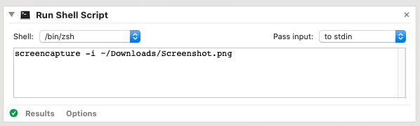
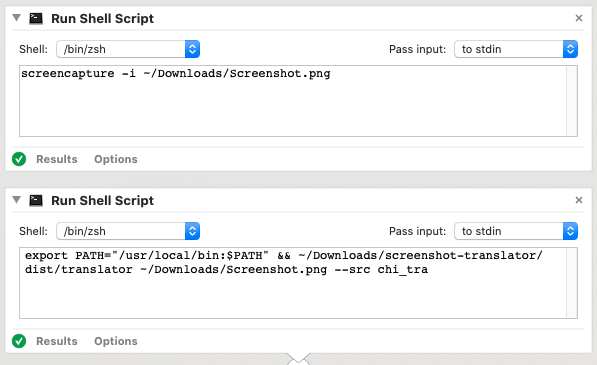
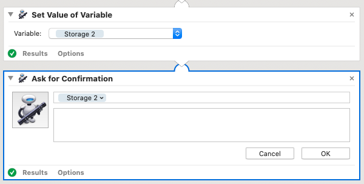
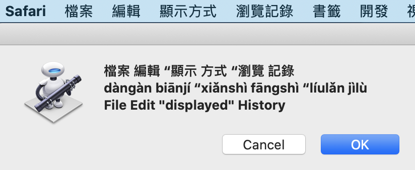
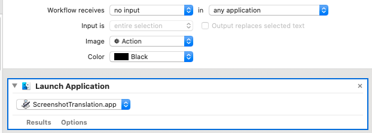
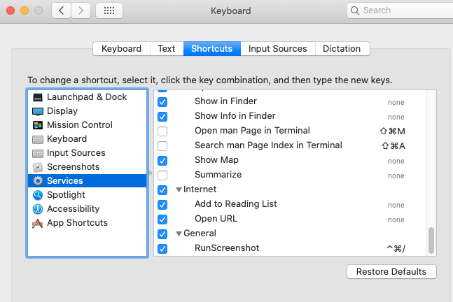

---
path: "/blog/diy-screenshot-translator"
date: "2020-05-04"
date_string: "May 4th, 2020"
title: "DIY Chi-Eng Screenshot Translator"
category: "walkthrough"
--- 
Lately I've been studying Mandarin Chinese and I decided that I should try changing my computer's language to Chinese.  It turns out that there are a bunch of obscure phrases like "File" and "Open in new tab" that I didn't know how to read.  Chrome extensions didn't cover all the cases, and I didn't want to pay for an app, so I built my own in just about 15 minutes.

So, want to be able to translate anything on your screen just by snapping a screenshot of it?  Let's build it.

Because of the easy screencapture and Automator tools, this walkthrough is meant for Mac users. [This repository](https://github.com/OneMoreGres/ScreenTranslator) looks interesting for Windows and Linux users.

The full code is available [here]().

### Handling image translation
We'll need a Python script that can extract and translate text from an image. For the text extraction (that is, an image of a letter to the letter itself), we'll use [Tesseract](https://github.com/tesseract-ocr/tesseract) a library originally made by HP, open sourced in 2005 and now maintained by Google.  We'll use it through a library called [pytesseract](https://pypi.org/project/pytesseract/)

As an extra step, let's use the [pinyin](https://pypi.org/project/pinyin/) library to translate Chinese characters to pinyin.  If you're using a different language, this wouldn't be necessary.

For translation, let's use the free [googletrans](https://pypi.org/project/googletrans/) library.

For deployment (Automator doesn't play nice with Python virtual environments) we'll use [Pyinstaller](https://realpython.com/pyinstaller-python/).

First check if `tesseract` is installed by running this in your terminal:

``` sh
tesseract
```

If not, you can install it with `brew install tesseract` ([what's brew?](https://brew.sh)).

Double check that you have Chinese installed for tesseract:

``` sh
cd /usr/local/share/tessdata
ls
```
If you don't see `chi_tra.traineddata` then get it and place it into `/usr/local/share/tessdata` using `wget`:

``` sh
wget https://github.com/tesseract-ocr/tessdata/raw/master/chi_tra.traineddata
```

Let's make a new project folder and setup the virtual environment ([what's that?](https://docs.python.org/3/tutorial/venv.html)):

``` sh
python3 --version # make sure it's greater than 3.5
mkdir screenshot-translator && cd screenshot-translator
python3 -m venv env
source env/bin/activate
```

And install pytesseract, pinyin and googletrans:

``` sh
pip3 install pytesseract
pip3 install pinyin
pip3 install googletrans
pip3 install pyinstaller
```

And make a new source file:

``` sh
touch translator.py
```

Inside our source file let's import the packages:

``` python
from PIL import Image
from googletrans import Translator
import pytesseract
import pinyin
```

Let's do some argument parsing ([what's that?]()) to make our program more flexible:

``` python
import argparse
parser = argparse.ArgumentParser(description="Translate an image of chinese text to its characters, pinyin and English")
parser.add_argument("file", type=str)
parser.add_argument("--src", default="chi_tra")
args = parser.parse_args()
```

 Notice that the parser's **src** argument means the source language (chi\_tra is traditional Chinese but there are many [options](https://www.loc.gov/standards/iso639-2/php/code_list.php)).  Let's assign the variables we'll need, including the source language, Google Translator object, and image itself:

``` python
lang = args.src
translator = Translator()
img = Image.open(args.file)
```

Now let's do the translation.  We'll use `pytesseract.image_to_string` and pass in our image and language.  We'll use `pinyin.get(characters)` to obtain the pinyin translation, and `translation.translate(characters).text` to get the English translation text.

(Note: in Chinese, pytesseract will add spaces between each character, so we remove these for more accurate translation)
``` python
characters = pytesseract.image_to_string(img, lang=lang, config=config)
characters_nospace = characters.replace(" ", "")
pinyin = pinyin.get(characters)
english = translator.translate(characters_nospace).text
```

And output.

``` python
print(characters)
print(pinyin)
print(english)
```

Test it!  Take a screenshot, save it somewhere like `~/Downloads/sample.png`and run your Python script on it:
``` sh
python3 translator.py ~/Downloads/sample.png --src chi_tra
```

It should print the characters, pinyin and English translation.  If it works, then let's deploy:

``` sh
pyinstaller --onefile translator.py
```

Check in the `dist/`folder and you'll see a new executable, `translator`.  Using `pyinstaller` with the `--onefile` option makes our script slower because it bundles all of the required libraries in there, but it will work.

### Calling the script on screenshot
We'll use Automator to create a script that calls screencapture, saves it to an image, calls our Python script on that image, then displays an alert with the translation.

Open a new Automator application, and drag "Run a Shell Script" into the rightside window.  In the script box, call `screencapture -i` for interactive and give it a file path to write the screenshot.



Now drag in another "Run a Shell Script" block, and call your Python script on that image:



Finally, drag in a "Set Value of Variable" block and set the output of the script (what we printed) to a variable name.  Drag a "Ask for Confirmation" and place the same variable in the prompt.



Test it by clicking "Run" on the top right!  It should look something like this when done:



Save your application and try clicking it to run.  If the screenshots being taken appear to be of the desktop background but not the actual text, you will need to enable permissions in Security & Privacy to record your screen so that the screenshot will work.

### Making a hotkey

To make a hotkey (e.g. cmd + ctrl + /), create another Automator Script that is a "Quick Action". On the top, select "no input" because we want this to be able to run anytime under any application, drag in a "Launch Application" block and set the app to be Other > Automator application we just made previously.



Now go to System Preferences and under Keyboards > Shortcuts > Services, set a hotkey for your Automator QuickAction.  Test it out!



### Gotchas

- I've noticed that on large screens, tesseract performance degrades - you might need to make text bigger in order to have more accurate recognition.
- Every time you modify the Automator application, you will need to set the permissions again
